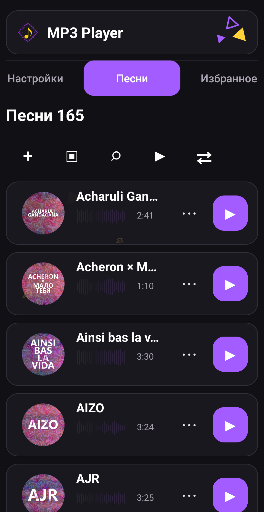
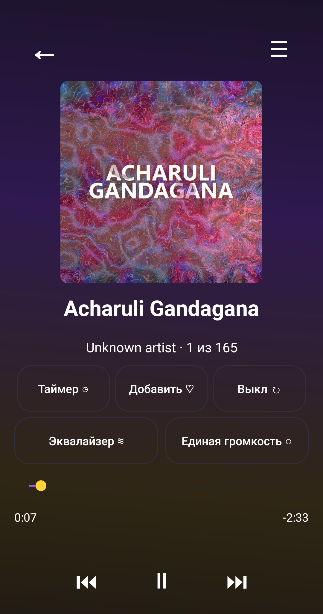
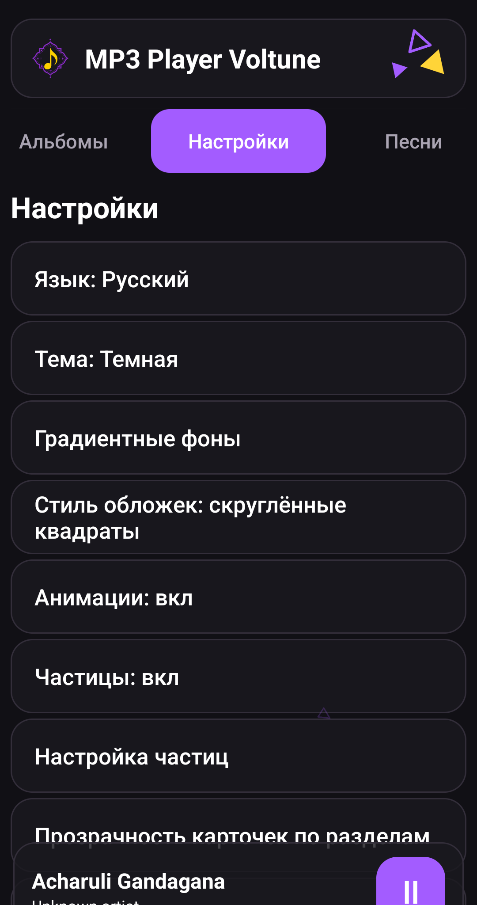
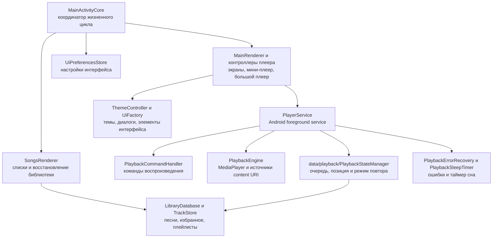
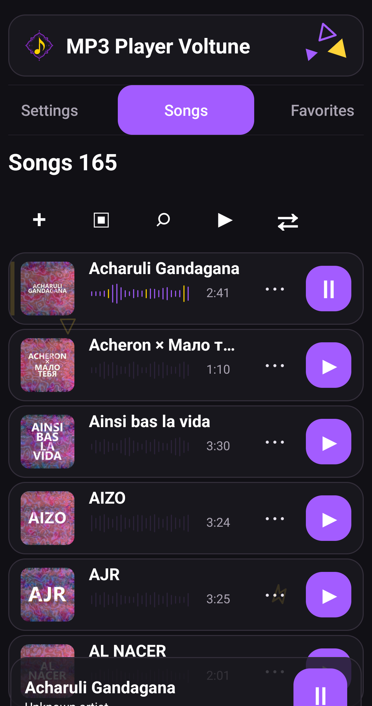
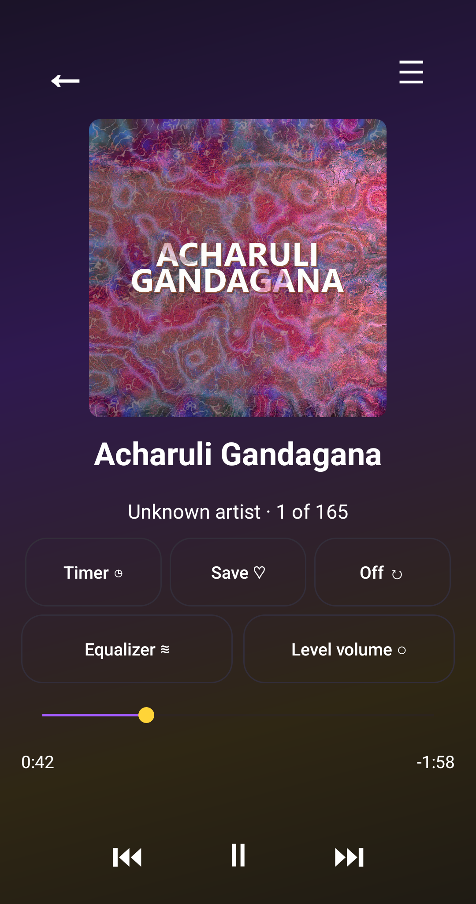
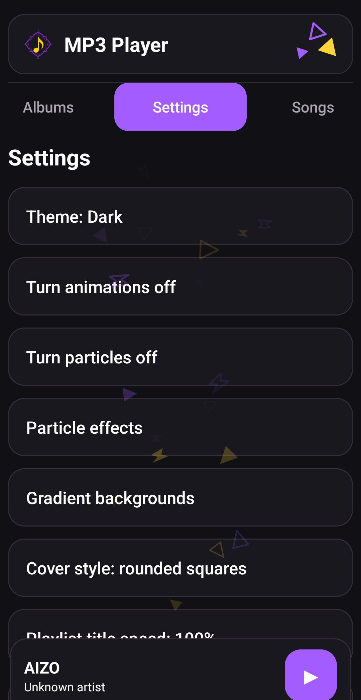
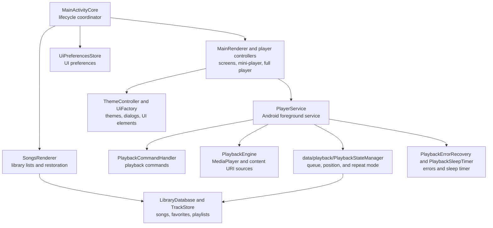

# MP3 Player Voltune

<p align="center">
  <a href="../../releases/latest/download/MP3-Player-Voltune.apk">
    
  </a>
  <a href="#english">
    
  </a>
</p>

MP3 Player Voltune — локальный музыкальный плеер для Android. Он воспроизводит музыку, уже скачанную на телефон, не требует регистрации и не отправляет библиотеку в интернет.

## Возможности

- Добавление одной песни, нескольких файлов или папки через системный выбор Android.
- Разделы «Песни», «Избранное», «Плейлисты», «Жанры», «Исполнители» и «Альбомы».
- Поиск, сортировка, очередь, последовательное и случайное воспроизведение.
- Фоновое воспроизведение и управление из системной медиапанели.
- Повтор песни или всей очереди до ручной остановки либо срабатывания таймера сна.
- Мини-плеер и большой плеер с качественной обложкой, перемоткой и управлением очередью.
- Плейлисты, избранное, эквалайзер и выравнивание воспринимаемой громкости.
- Светлая, тёмная и пользовательская темы, настраиваемые градиенты и прозрачность карточек.
- Скруглённые или вращающиеся круглые обложки, анимации и настраиваемые частицы.
- Русский и английский интерфейс.
- Локальные отчёты о сбоях без URI и путей к музыкальным файлам.

Все возможности приложения бесплатны. Приложение не содержит подписки и платных функций.

## Скриншоты

<p align="center">
  
  
  
</p>

## Как устроен проект



Новые независимые части размещаются по назначению: состояние — в `data/playback`, низкоуровневое воспроизведение — в `playback/service`, UI-утилиты — в `ui`, диагностика библиотеки — в `library`. Остальные классы переносятся постепенно, чтобы не ломать рабочие сценарии.

Основные точки расширения:

- Новый экран библиотеки: реализовать `MenuRenderer` и подключить его в `MainRenderer`.
- Новая настройка: добавить состояние в соответствующий контроллер и строку в `SettingsRenderer`.
- Новое действие воспроизведения: добавить команду в `PlaybackController` и обработать её в `PlayerService`.
- Изменение карточек песен: `SongsRenderer`, `UiFactory` и `ButtonFactory`.
- Изменение большого или мини-плеера: `FullPlayerController` или `MiniPlayerController`.
- Работа с библиотекой: `TrackStore`, `LibraryDatabase` и `PlaylistController`.
- Состояние фонового воспроизведения: `PlaybackStateManager`; подготовка аудио: `PlaybackEngine`.

## Сборка

Требуются JDK 17 и Android SDK:

```bash
./gradlew testDebugUnitTest lintDebug assembleDebugAndroidTest
```

Официальная release-сборка подписывается закрытым ключом через GitHub Actions. Готовый APK публикуется только в [GitHub Releases](../../releases/latest).

Правила участия описаны в [CONTRIBUTING.md](CONTRIBUTING.md), порядок сообщения об уязвимостях — в [SECURITY.md](SECURITY.md).

## Лицензия

Исходный код доступен для личного, образовательного и некоммерческого использования. Коммерческое применение требует разрешения автора. Это source-available проект с некоммерческой лицензией, а не лицензия OSI Open Source.

## Автор

Автор проекта Зейналов У. Р. о.

[Репозиторий MP3 Player Voltune](https://github.com/dumuzeyn/MP3-Player-Voltune)

[Поддержать автора через CloudTips](https://pay.cloudtips.ru/p/54e5a4f9). Поддержка является добровольной и безвозмездной, не открывает дополнительные функции, подписку или другие преимущества.

---

<a id="english"></a>

# MP3 Player Voltune

<p align="center">
  <a href="../../releases/latest/download/MP3-Player-Voltune.apk">
    
  </a>
  <a href="#mp3-player-voltune">
    
  </a>
</p>

MP3 Player Voltune is a local Android music player for audio already downloaded to the phone. It requires no account and does not upload the music library to the internet.

## Features

- Import one song, multiple files, or a complete folder through Android's system picker.
- Songs, Favorites, Playlists, Genres, Artists, and Albums sections.
- Search, sorting, queue management, sequential playback, and shuffle.
- Background playback with Android system media controls.
- Repeat one or repeat all until manually stopped or the sleep timer expires.
- Mini-player and full player with high-quality artwork, seeking, and queue controls.
- Playlists, favorites, equalizer, and perceived-volume leveling.
- Light, dark, and custom themes with configurable gradients and card opacity.
- Rounded or rotating circular artwork, animations, and configurable particles.
- Russian and English interface.
- Local crash reports that exclude music URIs and storage paths.

All application features are free. There are no subscriptions or paid features.

## Screenshots

<p align="center">
  
  
  
</p>

## Project Structure



New independent components are grouped by responsibility: state in `data/playback`, low-level playback in `playback/service`, UI utilities in `ui`, and library diagnostics in `library`. Remaining classes are moved incrementally to protect existing user workflows.

Common extension points:

- New library screen: implement `MenuRenderer` and connect it in `MainRenderer`.
- New setting: add its state to the responsible controller and its row to `SettingsRenderer`.
- New playback command: dispatch it through `PlaybackController` and handle it in `PlayerService`.
- Song card changes: use `SongsRenderer`, `UiFactory`, and `ButtonFactory`.
- Full-player or mini-player changes: use `FullPlayerController` or `MiniPlayerController`.
- Library persistence: use `TrackStore`, `LibraryDatabase`, and `PlaylistController`.
- Background playback state: use `PlaybackStateManager`; audio preparation: use `PlaybackEngine`.

## Build

JDK 17 and the Android SDK are required:

```bash
./gradlew testDebugUnitTest lintDebug assembleDebugAndroidTest
```

Official release builds are signed with a private key through GitHub Actions. The APK is published only in [GitHub Releases](../../releases/latest).

See [CONTRIBUTING.md](CONTRIBUTING.md) before contributing and [SECURITY.md](SECURITY.md) for private vulnerability reporting.

## License

The source code is available for personal, educational, and non-commercial use. Commercial use requires the author's permission. This is a source-available project under a non-commercial license, not an OSI Open Source license.

## Author

Project author: Zeynalov U. R. o.

[MP3 Player Voltune repository](https://github.com/dumuzeyn/MP3-Player-Voltune)

[Support the author through CloudTips](https://pay.cloudtips.ru/p/54e5a4f9). Support is voluntary and gratuitous and does not unlock additional features, a subscription, or any other benefit.
