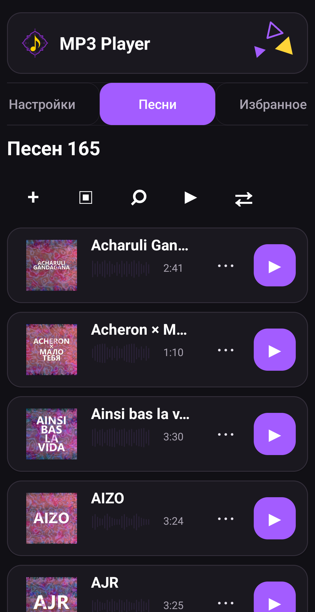
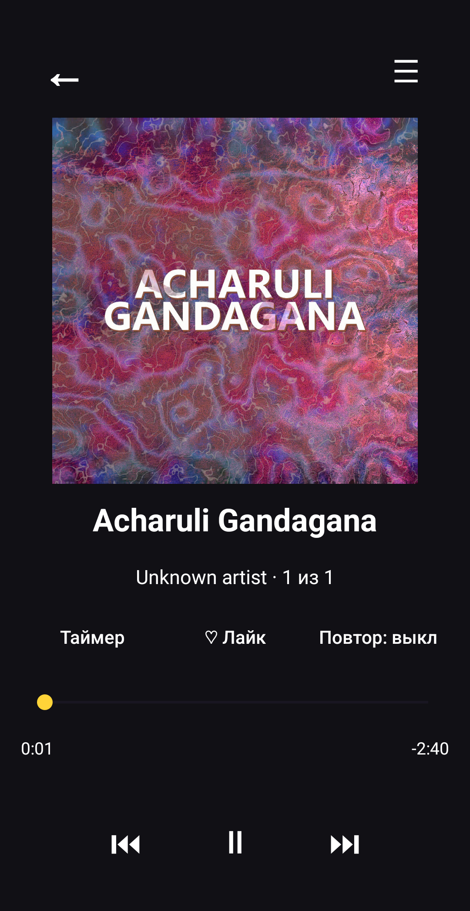
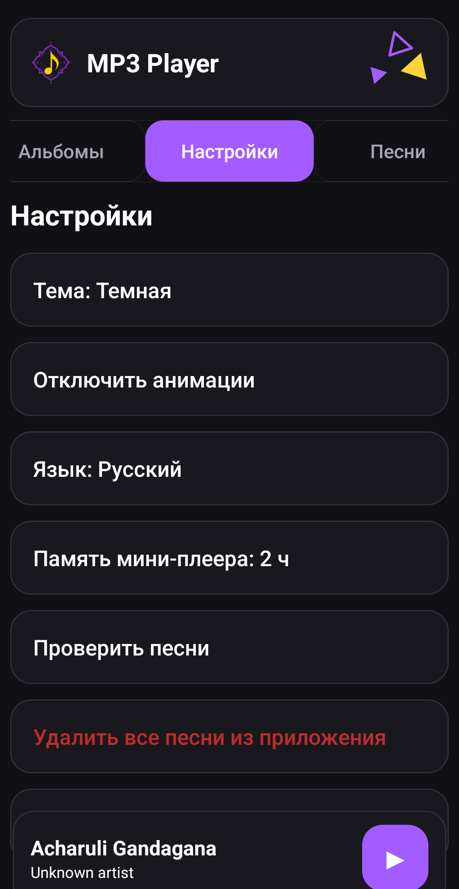

# MP3 Player APK

<p align="center">
  <a href="https://github.com/dumuzeyn/MP3-player/actions">
    
  </a>
  <a href="#english">
    
  </a>
</p>

MP3 Player APK - Android-приложение для локального прослушивания музыки. Оно работает без WebView, браузера и локального сервера: пользователь устанавливает APK, выбирает песни или папку через системный выбор Android, а приложение сохраняет доступ к этим файлам и воспроизводит их через foreground service.

Приложение не копирует, не изменяет и не удаляет исходные музыкальные файлы. Если удалить песню внутри MP3 Player, удаляется только запись из библиотеки приложения, а сам файл остается на телефоне.

## Скачать

Готовый APK не хранится в git как бинарный файл. Актуальную сборку нужно брать из GitHub Actions artifact или из GitHub Releases, когда релиз опубликован.

[Скачать APK / открыть GitHub Actions](https://github.com/dumuzeyn/MP3-player/actions)

Если Android предупреждает об установке из неизвестного источника, разреши установку APK для приложения, через которое открыт файл. Это стандартное поведение Android для APK не из магазина.

## Скриншоты

<p align="center">
  
  
  
</p>

## Что умеет приложение

- Добавлять одну песню, несколько песен или целую папку с музыкой через Android SAF.
- Сохранять persistable URI permissions, чтобы песни играли после перезапуска телефона и приложения.
- Показывать название, исполнителя, альбом, длительность и встроенную обложку.
- Кешировать обложки, чтобы список и большой плеер не мигали при повторном открытии.
- Показывать список песен, избранное, плейлисты, жанры, исполнителей и альбомы.
- Искать песни, сортировать библиотеку и запускать текущий список подряд или в случайном порядке.
- Создавать плейлисты, добавлять песни в избранное и управлять очередью воспроизведения.
- Играть в фоне через `PlayerService` с foreground notification.
- Открывать большой плеер с качественной обложкой, seek bar, таймером, повтором, лайком и очередью.
- Закрывать большой плеер свайпом вниз из любой области экрана.
- Показывать мини-плеер снизу и восстанавливать его состояние после повторного открытия приложения.
- Переключать светлую, темную и пользовательскую тему.
- Для пользовательской темы выбирать цвет фона и текста.
- Менять язык интерфейса между русским и английским.
- Использовать vector/adaptive icon ресурсы без PNG для иконки приложения.

## Что нового в текущей версии

- `MainActivity` разгружен первыми отдельными классами: `SongsRenderer`, `PlayerUiController`, `SettingsRenderer`, `TabsController`, `PlaybackController`, `ThemeController`.
- Убраны сгенерированные имена вида `AnonymousClass...`, `RunnableC000...`, `m19$$Nest...`; внутренние методы получили читаемые названия.
- Release-сборка включает `minifyEnabled true` и `shrinkResources true`.
- README полностью обновлен, добавлены реальные скриншоты с телефона без верхней панели уведомлений.
- APK больше не хранится в `output/` как основной способ распространения; сборку нужно брать из Actions/Releases.

## Как устроен проект

Основной пакет приложения: `app/src/main/java/com/dumuzeyn/mp3player`.

`MainActivity` остается главным экраном и точкой сборки UI. В нем все еще находится много Android View-кода, но теперь часть ответственности вынесена в отдельные классы-контроллеры. Это первый шаг к нормальной архитектуре без риска сломать весь плеер одним большим рефакторингом.

`SongsRenderer` отвечает за рендер списка песен. Если нужно менять карточку песни, кнопки строки, отображение длительности, waveform или поведение списка, начинать нужно отсюда и с метода `renderSongsInternal()` в `MainActivity`.

`PlayerUiController` управляет большим и мини-плеером. Он вызывает внутренние методы `openFullPlayerInternal()` и `updateMiniInternal()`. Все доработки большого плеера, мини-плеера, свайпа вниз, seek bar и состояния текущего трека должны постепенно уходить сюда.

`SettingsRenderer` отвечает за экран настроек. Темы, язык, отключение анимаций, проверка песен и опасные действия вроде удаления библиотеки относятся к этому направлению.

`TabsController` управляет верхними вкладками и жестами переключения меню. Если нужно менять силу свайпа, поведение бесконечной ленты вкладок или переключение разделов, смотри этот класс и методы `buildTabsInternal()`, `tabDirectionToInternal()`, `isInsideTabsInternal()`.

`PlaybackController` связывает UI с командами воспроизведения: play, pause, next, previous. Сейчас он делегирует в `MainActivity`, но новые команды очереди и истории лучше добавлять через него, чтобы не раздувать главный activity дальше.

`ThemeController` содержит простую обвязку над цветовой логикой. Базовая работа с палитрами и сохранением темы находится в `ThemeManager`, а применение темы к текущему экрану пока выполняет `MainActivity`.

`PlayerService` - foreground service для реального воспроизведения. Он работает с `MediaPlayer`, audio focus, уведомлением, wake lock, `prepareAsync()`, ошибками чтения трека и переходом по очереди. Если музыка не играет, сначала проверяй именно `PlayerService` и URI, который в него передается.

`TrackStore` отвечает за импорт файлов, чтение метаданных и сохранение песен. Здесь важны `content://` URI, `takePersistableUriPermission(...)`, проверка доступности файла и получение длительности через `MediaMetadataRetriever`.

`LibraryDatabase` хранит библиотеку, избранное и плейлисты в SQLite. Настройки интерфейса и легкое состояние плеера остаются в `SharedPreferences`.

`PlaylistManager` содержит вспомогательную логику плейлистов: поиск, очистку имен, сериализацию старого формата и совместимость с миграцией.

`SongRowStateRegistry` хранит состояние строк песен отдельно от activity, чтобы при обновлении списка не терять текущий прогресс и не пересоздавать лишнее состояние.

`WaveformView` рисует визуальную дорожку под названием песни. `TriangleDecorView` рисует декоративные треугольники в шапке.

## Как добавить новую функцию

1. Найди область функции: список песен, плеер, настройки, вкладки, воспроизведение, тема или хранение.
2. Добавляй новый код в соответствующий controller/manager, а не сразу в `MainActivity`.
3. Если старый UI-код пока находится в `MainActivity`, сделай маленький внутренний метод `...Internal()` и вызывай его через controller.
4. Для песен и плейлистов не добавляй новые JSON-строки в `SharedPreferences`; используй `LibraryDatabase`.
5. Для настроек интерфейса можно использовать `SharedPreferences`, потому что это маленькие значения.
6. Для Android-файлов используй `content://` URI и persistable permissions. Не сохраняй путь вида `/storage/...` как основной источник.
7. После изменения запускай `./gradlew clean testDebugUnitTest assembleDebug assembleRelease`.
8. Проверяй на телефоне: импорт одной песни, импорт папки, запуск песни, большой плеер, мини-плеер, смена темы.

## Сборка

Для локальной debug-сборки:

```bash
./gradlew clean assembleDebug
```

Для release-сборки:

```bash
./gradlew clean assembleRelease
```

Release использует R8:

```gradle
release {
    minifyEnabled true
    shrinkResources true
}
```

Если заданы переменные `MP3_RELEASE_KEYSTORE`, `MP3_RELEASE_KEY_ALIAS`, `MP3_RELEASE_STORE_PASS`, `MP3_RELEASE_KEY_PASS`, Gradle подпишет release этим ключом. Если переменных нет, CI использует репозиторный debug-like ключ только для сборочной проверки.

## Авторство

Проект: MP3 Player APK. Автор: Rasul / dumuzeyn.

---

<a id="english"></a>

# MP3 Player APK

<p align="center">
  <a href="https://github.com/dumuzeyn/MP3-player/actions">
    
  </a>
  <a href="#mp3-player-apk">
    
  </a>
</p>

MP3 Player APK is a native Android app for local music playback. It does not use a browser, WebView, or local server. The user installs the APK, selects audio files or a music folder through Android system pickers, and the app stores access to those files for playback through a foreground service.

The app does not copy, modify, or delete the original music files. Removing a song inside MP3 Player removes only the app library entry; the file stays on the phone.

## Download

The built APK is not stored in git as a binary file. Download the current APK from GitHub Actions artifacts or GitHub Releases when a release is published.

[Download APK / open GitHub Actions](https://github.com/dumuzeyn/MP3-player/actions)

If Android warns about installing from an unknown source, allow APK installation for the app that opened the file. This is normal Android behavior for apps installed outside a store.

## Screenshots

<p align="center">
  
  
  
</p>

## Features

- Import one song, multiple songs, or a full music folder through Android SAF.
- Persist URI permissions so imported songs remain playable after app and phone restarts.
- Display title, artist, album, duration, waveform, and embedded album art.
- Cache album art so lists and the full player do not flicker on repeated renders.
- Browse songs, favorites, playlists, genres, artists, and albums.
- Search the library and play the current list in order or shuffle mode.
- Create playlists, favorite songs, and manage the playback queue.
- Play in the background through `PlayerService` with a foreground notification.
- Open a full player with high-quality album art, seek bar, timer, repeat, like, and queue access.
- Close the full player with a downward swipe from any area of the screen.
- Show a bottom mini-player and restore its state after reopening the app.
- Switch between light, dark, and custom themes.
- Pick custom background and text colors for the custom theme.
- Switch the UI language between Russian and English.
- Use vector/adaptive icon resources without PNG launcher assets.

## Current Version Highlights

- `MainActivity` has been split into the first dedicated classes: `SongsRenderer`, `PlayerUiController`, `SettingsRenderer`, `TabsController`, `PlaybackController`, `ThemeController`.
- Generated-looking names such as `AnonymousClass...`, `RunnableC000...`, and `m19$$Nest...` were replaced with readable names.
- Release builds now use `minifyEnabled true` and `shrinkResources true`.
- The README was rebuilt and now includes real phone screenshots without the notification bar.
- APK files are no longer tracked in `output/` as the main distribution path; use Actions/Releases instead.

## Project Structure

Main package: `app/src/main/java/com/dumuzeyn/mp3player`.

`MainActivity` is still the main screen and UI composition host. It still contains a lot of Android View code, but responsibilities are now being moved into small controller classes. This keeps the app working while reducing the risk of a huge one-shot refactor.

`SongsRenderer` renders the song list. If you need to change song cards, row buttons, duration display, waveform display, or list behavior, start there and at `renderSongsInternal()` in `MainActivity`.

`PlayerUiController` controls the full player and mini-player. It delegates to `openFullPlayerInternal()` and `updateMiniInternal()`. Full player layout, swipe-down behavior, seek bar, and current-track UI should gradually move here.

`SettingsRenderer` renders the settings screen. Theme switching, language switching, disabled animations, song checks, and destructive library actions belong here.

`TabsController` controls top tabs and menu swipe behavior. If you need to change swipe sensitivity, the infinite tab strip, or tab switching, check this class and `buildTabsInternal()`, `tabDirectionToInternal()`, `isInsideTabsInternal()`.

`PlaybackController` connects UI actions to playback commands: play, pause, next, previous. New queue and history commands should go through this controller instead of growing `MainActivity`.

`ThemeController` wraps theme helper logic. Palette rules and saved theme data are handled by `ThemeManager`; applying the active palette to views still happens mostly in `MainActivity`.

`PlayerService` is the foreground service that performs playback. It owns `MediaPlayer`, audio focus, notification updates, wake lock, `prepareAsync()`, playback errors, and queue advancement. If music does not play, inspect `PlayerService` and the URI passed into it first.

`TrackStore` handles file import, metadata reading, and song persistence. The critical parts are `content://` URIs, `takePersistableUriPermission(...)`, file readability checks, and duration extraction through `MediaMetadataRetriever`.

`LibraryDatabase` stores the song library, favorites, and playlists in SQLite. Lightweight UI settings and resume state remain in `SharedPreferences`.

`PlaylistManager` contains playlist helpers: lookup, name cleanup, legacy JSON serialization, and migration compatibility.

`SongRowStateRegistry` stores row state outside the activity so list rerenders do not lose current progress or recreate unnecessary state.

`WaveformView` draws the waveform below song titles. `TriangleDecorView` draws the header triangle decoration.

## Adding a Feature

1. Identify the feature area: songs, player, settings, tabs, playback, theme, or storage.
2. Add new code to the matching controller/manager instead of placing everything directly in `MainActivity`.
3. If older UI code still lives in `MainActivity`, expose a small `...Internal()` method and call it through a controller.
4. For songs and playlists, do not add new JSON strings in `SharedPreferences`; use `LibraryDatabase`.
5. For small UI settings, `SharedPreferences` is fine.
6. For Android files, use `content://` URIs and persistable permissions. Do not rely on `/storage/...` paths as the main source.
7. After changes, run `./gradlew clean testDebugUnitTest assembleDebug assembleRelease`.
8. Test on a phone: single-song import, folder import, playback, full player, mini-player, and theme switching.

## Build

Debug build:

```bash
./gradlew clean assembleDebug
```

Release build:

```bash
./gradlew clean assembleRelease
```

Release uses R8:

```gradle
release {
    minifyEnabled true
    shrinkResources true
}
```

If `MP3_RELEASE_KEYSTORE`, `MP3_RELEASE_KEY_ALIAS`, `MP3_RELEASE_STORE_PASS`, and `MP3_RELEASE_KEY_PASS` are set, Gradle signs release builds with that key. Without them, CI uses the repository debug-like key only for build verification.

## Authorship

Project: MP3 Player APK. Author: Rasul / dumuzeyn.
