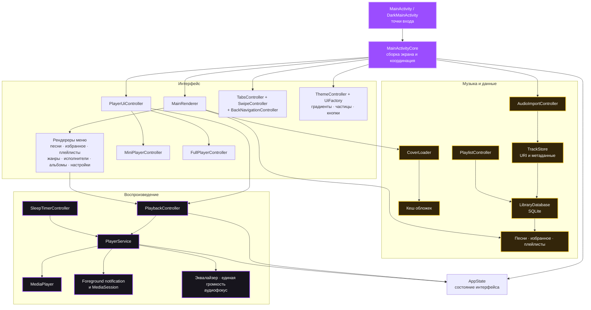
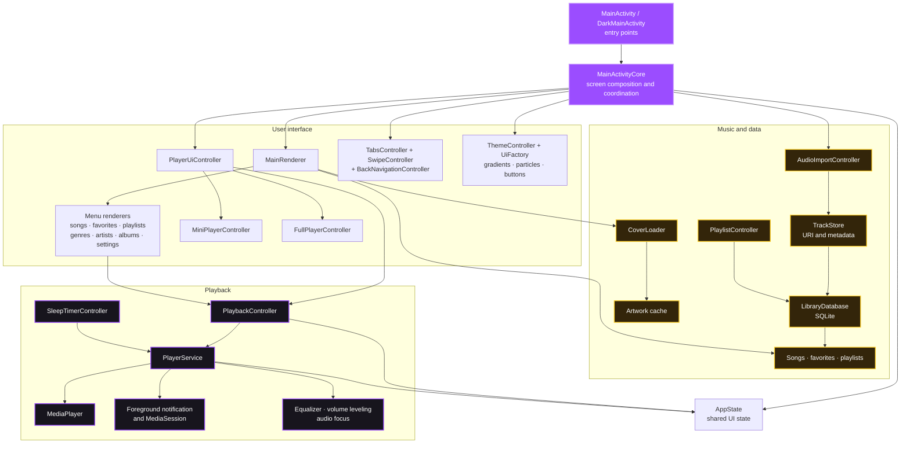

# MP3 Player

<p align="center">
  <a href="https://github.com/dumuzeyn/MP3-player-APK/actions/workflows/android.yml">
    
  </a>
  <a href="#english">
    
  </a>
</p>

MP3 Player — Android-плеер для музыки, уже скачанной на телефон. Он открывает локальные аудиофайлы через системный выбор Android, сохраняет доступ к ним и воспроизводит музыку в приложении, в фоне и через системную медиапанель.

## Возможности

### Библиотека и импорт

- Добавление одной песни, нескольких файлов или целой папки через Android Storage Access Framework.
- Сохранение разрешений для `content://` URI, чтобы треки оставались доступны после перезапуска приложения и телефона.
- Проверка доступности файла перед добавлением в библиотеку.
- Чтение названия, исполнителя, альбома, продолжительности и встроенной обложки.
- Повторное получение отсутствующих метаданных без блокировки интерфейса.
- Разделы «Песни», «Избранное», «Плейлисты», «Жанры», «Исполнители», «Альбомы» и «Настройки».
- Поиск по библиотеке, сортировка, последовательное и случайное воспроизведение текущего списка.
- Диагностика недоступных и повреждённых треков.
- Удаление записи из библиотеки без удаления исходного аудиофайла с телефона.

### Плейлисты и очередь

- Создание, переименование и удаление плейлистов.
- Добавление одной или нескольких песен в плейлист.
- Поиск песен во время добавления в плейлист.
- Добавление трека в избранное или любой пользовательский плейлист через одну кнопку большого плеера.
- Удаление песни из плейлиста через свойства трека.
- Очередь воспроизведения с просмотром, запуском выбранной позиции и удалением элементов.
- Добавление песни в текущую очередь из её свойств.
- Анимированные титры и смена обложки на карточках плейлистов с регулируемой скоростью.

### Воспроизведение

- Фоновое воспроизведение через foreground service и системную медиапанель Android.
- Асинхронная подготовка треков через `MediaPlayer.prepareAsync()`.
- Play, pause, предыдущая и следующая песня, перемотка и восстановление позиции.
- Повтор выключен, повтор очереди и повтор одного трека.
- Случайный порядок воспроизведения.
- Защита от мгновенного пролистывания всей очереди при повреждённых или недоступных файлах.
- Восстановление последнего трека, очереди, позиции и режима повтора.
- Настраиваемое время хранения состояния мини-плеера.
- Режим «Всегда играть», который не отдаёт обычный аудиофокус другим приложениям.
- Режим без приглушения громкости при изменении аудиофокуса.
- Обработка отключения наушников, если режим непрерывного воспроизведения не включён.

### Мини-плеер и большой плеер

- Мини-плеер с названием, исполнителем и кнопкой play/pause.
- Открытие большого плеера нажатием на мини-плеер.
- Удаление мини-плеера горизонтальным свайпом вместе с очисткой очереди и сохранённого состояния.
- Большой плеер с качественной обложкой, очередью, seek bar и транспортными кнопками.
- Закрытие большого плеера лёгким свайпом вниз из любой области экрана.
- Таймер сна с готовыми вариантами, пользовательской длительностью и остановкой воспроизведения.
- Добавление трека в избранное или плейлист прямо из большого плеера.
- Эквалайзер с отдельными полосами частот.
- Выравнивание воспринимаемой громкости между песнями.

### Оформление и управление

- Светлая, тёмная и пользовательская темы.
- Выбор любого цвета фона и текста пользовательской темы через цветовое колесо.
- Отдельный градиент для основного интерфейса и большого плеера.
- Независимый выбор двух цветов каждого градиента.
- Скруглённые квадратные обложки или вращающиеся круглые обложки.
- Синхронизация формы обложки с системной медиапанелью.
- Плавные свайпы между меню с предварительным отображением соседнего экрана.
- История навигации для системной кнопки «Назад».
- Независимое отключение анимаций и частиц.
- Фиолетовые и жёлтые частицы-треугольники и молнии, реагирующие на касания.
- Настройка частоты, размера и времени жизни частиц в безопасных пределах.
- Русский и английский интерфейс.
- Тематические vector/adaptive launcher icons и отдельные splash-ресурсы.

## Скриншоты

<p align="center">
  
  
  
</p>

## Как взаимодействуют части приложения



`MainActivityCore` создаёт общую структуру экрана и связывает специализированные компоненты. Рендереры получают данные из состояния и базы, а команды воспроизведения отправляют через `PlaybackController` в `PlayerService`. Сервис владеет `MediaPlayer`, обновляет `MediaSession` и возвращает актуальное состояние в интерфейс. Импорт идёт отдельно: системный picker передаёт URI в `AudioImportController`, затем `TrackStore` проверяет файл и метаданные, а `LibraryDatabase` сохраняет библиотеку.

## Ответственность файлов

Основной код находится в `app/src/main/java/com/dumuzeyn/mp3player`.

### Точки входа и состояние

- `MainActivity.java` — светлая точка входа приложения.
- `DarkMainActivity.java` — точка входа с тёмной системной темой окна.
- `MainActivityCore.java` — создаёт корневой UI, соединяет контроллеры, обрабатывает lifecycle и хранит только общие делегаты.
- `AppState.java` — единое состояние: текущий трек, очередь, вкладка, поиск, тема, язык, таймер и визуальные настройки.

### Экраны и списки

- `MainRenderer.java` — выбирает рендерер активного раздела и координирует обновление экрана.
- `MenuRenderer.java` — общий контракт для рендереров меню.
- `SongsMenuRenderer.java` — загружает и показывает общую библиотеку песен.
- `FavoritesMenuRenderer.java` — загружает и показывает избранные песни.
- `PlaylistsMenuRenderer.java` — показывает карточки плейлистов и их анимированные превью.
- `GenresMenuRenderer.java` — группирует библиотеку по жанрам.
- `ArtistsMenuRenderer.java` — группирует библиотеку по исполнителям.
- `AlbumsMenuRenderer.java` — группирует библиотеку по альбомам.
- `SettingsMenuRenderer.java` — подключает экран настроек к общей системе меню.
- `SongsRenderer.java` — создаёт карточки песен, очередь, waveform и порционную отрисовку списка.
- `TrackGroupMenuRenderer.java` — общая реализация карточек жанров, исполнителей и альбомов.
- `SettingsRenderer.java` — создаёт список пользовательских настроек.
- `LibraryListController.java` — фильтрует библиотеку, избранное и текущий видимый список.
- `HeaderController.java` — строит шапку приложения и панель действий активного раздела.

### Плеер

- `PlayerUiController.java` — связывает мини-плеер и большой плеер с общим состоянием.
- `MiniPlayerController.java` — создаёт мини-плеер, обновляет его и обрабатывает свайп удаления.
- `FullPlayerController.java` — полностью создаёт большой плеер, кнопки, очередь, seek bar и свайп закрытия.
- `PlaybackController.java` — формирует очередь, восстанавливает сессию и отправляет команды сервису.
- `PlayerService.java` — владеет `MediaPlayer`, audio focus, wake lock, MediaSession и уведомлением.
- `SleepTimerController.java` — запускает, отображает и отменяет таймер сна.
- `EqualizerController.java` — хранит настройки эквалайзера и управляет его интерфейсом.
- `VolumeLevelingController.java` — включает и отображает режим выравнивания громкости.
- `StableVolumeController.java` — управляет запретом приглушения при изменении аудиофокуса.
- `UninterruptedPlaybackController.java` — управляет режимом непрерывного воспроизведения.
- `SongRowStateRegistry.java` — обновляет play-кнопки, индикаторы, waveform и обложки без полного ререндера списка.
- `WaveformView.java` — рисует визуальную звуковую дорожку песни.
- `RotatingCoverImageView.java` — делает обложку круглой и вращает её во время воспроизведения.
- `PlayerGradientBackground.java` — рисует настраиваемый анимированный градиент.

### Импорт, библиотека и плейлисты

- `AudioImportController.java` — запускает выбор файлов/папки и обрабатывает результат Android SAF.
- `TrackStore.java` — проверяет URI, читает метаданные и объединяет восстановленные данные трека.
- `Track.java` — модель одной песни.
- `LibraryDatabase.java` — SQLite-хранилище песен, избранного и плейлистов, включая миграцию старых данных.
- `Playlist.java` — модель пользовательского плейлиста.
- `PlaylistManager.java` — очистка названий и совместимость со старым JSON-форматом.
- `PlaylistController.java` — создание, переименование и удаление плейлистов, добавление и удаление песен.
- `CoverLoader.java` — асинхронно читает и кеширует встроенные обложки.
- `FrameLayoutCover.java` — контейнер обложки плейлиста с плавной сменой изображения.
- `SmoothPlaylistTicker.java` — непрерывно прокручивает названия песен в карточке плейлиста.
- `PlaylistTickerSettingsController.java` — регулирует скорость титров плейлистов.

### Навигация, диалоги и оформление

- `TabsController.java` — строит циклическую ленту вкладок и плавно двигает активный индикатор.
- `SwipeController.java` — обрабатывает свайпы между разделами и предварительный экран соседнего меню.
- `BackNavigationController.java` — хранит историю вкладок и реализует системную кнопку «Назад».
- `OverlayController.java` — показывает поиск, свойства песен, очередь и выбор плейлистов.
- `DialogController.java` — общий безопасный диалог подтверждения.
- `SettingsController.java` — язык, память мини-плеера, диагностика и очистка пользовательских данных.
- `ThemeController.java` — применяет тему окна, пользовательские цвета и launcher alias.
- `ThemeManager.java` — вычисляет контрастные цвета и смешивает оттенки.
- `GradientSettingsController.java` — выбирает режим и цвета градиентов основного экрана и плеера.
- `ThemeColorWheelView.java` — рисует полное цветовое колесо и выбирает оттенок/яркость.
- `ParticleEffectsView.java` — рисует фоновые частицы и эффекты касания.
- `ParticleSettingsController.java` — регулирует частоту, размер и время жизни частиц.
- `ButtonFactory.java` — создаёт единообразные кнопки и их состояния.
- `UiFactory.java` — создаёт общие элементы, карточки, панели, отступы и формы.
- `TriangleDecorView.java` — рисует треугольный декор шапки.

### Сборка и проверки

- `app/src/main/AndroidManifest.xml` — разрешения, activity aliases и foreground service.
- `app/build.gradle` — Android-конфигурация, версия, подпись и release-настройки R8.
- `app/proguard-rules.pro` — правила сохранения необходимых классов при minify.
- `.github/workflows/android.yml` — unit-тесты, release-сборка и публикация APK artifact.
- `TrackStoreTest.java` — тесты сортировки и миграции данных песен.
- `PlaylistManagerTest.java` — тесты сохранения плейлистов и очистки названий.

## Сборка

Требуются Android SDK и JDK 17.

```bash
./gradlew clean testDebugUnitTest assembleRelease
```

Release APK создаётся в `app/build/outputs/apk/release/`. Готовые APK не хранятся в git: актуальную сборку загружает GitHub Actions.

## Авторство

MP3 Player создан и развивается Rasul / [dumuzeyn](https://github.com/dumuzeyn).

---

<a id="english"></a>

# MP3 Player

<p align="center">
  <a href="https://github.com/dumuzeyn/MP3-player-APK/actions/workflows/android.yml">
    
  </a>
  <a href="#mp3-player">
    
  </a>
</p>

MP3 Player is an Android player for music already downloaded to the phone. It opens local audio through Android's system picker, keeps access to selected files, and plays music inside the app, in the background, and through the system media panel.

## Features

### Library and import

- Import one song, multiple files, or an entire folder through Android Storage Access Framework.
- Persist `content://` URI permissions so tracks remain available after app and device restarts.
- Verify file readability before adding it to the library.
- Read title, artist, album, duration, and embedded artwork.
- Refresh missing metadata without blocking the interface.
- Browse Songs, Favorites, Playlists, Genres, Artists, Albums, and Settings.
- Search and sort the library, then play the current list in order or shuffle mode.
- Diagnose unavailable and corrupted tracks.
- Remove a library entry without deleting the original audio file from the phone.

### Playlists and queue

- Create, rename, and delete playlists.
- Add one or multiple songs to a playlist.
- Search while selecting songs for a playlist.
- Use one full-player button to save a track to Favorites or any custom playlist.
- Remove a song from a playlist through track properties.
- View the playback queue, start any position, and remove queue items.
- Add a song to the current queue from its properties.
- Animated playlist titles and artwork previews with adjustable speed.

### Playback

- Background playback through a foreground service and Android system media controls.
- Asynchronous track preparation through `MediaPlayer.prepareAsync()`.
- Play, pause, previous, next, seeking, and position recovery.
- Repeat off, repeat queue, and repeat one track.
- Shuffle playback.
- Protection against rapidly skipping through the whole queue when files are broken or unavailable.
- Restore the last track, queue, position, and repeat mode.
- Configurable mini-player state retention time.
- Always Play mode that does not yield normal audio focus to other apps.
- Stable Volume Focus mode that prevents focus-driven ducking.
- Headphone disconnect handling when uninterrupted playback is disabled.

### Mini-player and full player

- Mini-player with title, artist, and play/pause.
- Open the full player by tapping the mini-player.
- Dismiss the mini-player with a horizontal swipe, clearing both queue and saved playback state.
- Full player with high-quality artwork, queue, seek bar, and transport controls.
- Close the full player with a light downward swipe from any part of the screen.
- Sleep timer with presets, custom duration, and playback stop.
- Save the current track to Favorites or a playlist from the full player.
- Multi-band equalizer.
- Per-track perceived volume leveling.

### Appearance and navigation

- Light, dark, and custom themes.
- Pick any custom background and text colors using a full color wheel.
- Separate gradients for the main interface and full player.
- Independently select both colors of each gradient.
- Rounded-square artwork or spinning circular artwork.
- Synchronize circular artwork with the system media panel.
- Smooth menu swipes with a live preview of the adjacent screen.
- Back-stack navigation for the phone's system Back button.
- Disable animations and particles independently.
- Purple and yellow triangle/lightning particles, including touch effects.
- Bounded particle frequency, size, and lifetime controls.
- Russian and English interface.
- Theme-aware vector/adaptive launcher icons and dedicated splash resources.

## Screenshots

<p align="center">
  
  
  
</p>

## Component interaction



`MainActivityCore` builds the shared screen structure and connects specialized components. Renderers read state and database data, while playback commands travel through `PlaybackController` to `PlayerService`. The service owns `MediaPlayer`, updates `MediaSession`, and exposes current playback state to the UI. Import follows a separate path: Android's picker returns a URI to `AudioImportController`, `TrackStore` validates the file and metadata, and `LibraryDatabase` persists the library.

## File responsibilities

The main package is `app/src/main/java/com/dumuzeyn/mp3player`.

### Entry points and state

- `MainActivity.java` — light-system-theme application entry point.
- `DarkMainActivity.java` — dark-system-theme application entry point.
- `MainActivityCore.java` — composes the root UI, connects controllers, handles lifecycle, and keeps shared delegates only.
- `AppState.java` — shared track, queue, tab, search, theme, language, timer, and visual state.

### Screens and lists

- `MainRenderer.java` — selects the active section renderer and coordinates screen refreshes.
- `MenuRenderer.java` — common menu-renderer contract.
- `SongsMenuRenderer.java` — loads and displays the complete song library.
- `FavoritesMenuRenderer.java` — loads and displays favorite songs.
- `PlaylistsMenuRenderer.java` — displays playlist cards and animated previews.
- `GenresMenuRenderer.java` — groups the library by genre.
- `ArtistsMenuRenderer.java` — groups the library by artist.
- `AlbumsMenuRenderer.java` — groups the library by album.
- `SettingsMenuRenderer.java` — connects settings to the common menu system.
- `SongsRenderer.java` — creates song cards, queue rows, waveforms, and chunked list rendering.
- `TrackGroupMenuRenderer.java` — shared implementation for genre, artist, and album cards.
- `SettingsRenderer.java` — creates the user-facing settings list.
- `LibraryListController.java` — filters the library, favorites, and current visible list.
- `HeaderController.java` — builds the app header and active-section action bar.

### Player

- `PlayerUiController.java` — connects mini-player and full player to shared state.
- `MiniPlayerController.java` — builds and updates the mini-player and handles swipe dismissal.
- `FullPlayerController.java` — owns the full-player layout, buttons, queue, seek bar, and close gesture.
- `PlaybackController.java` — builds queues, restores sessions, and sends service commands.
- `PlayerService.java` — owns `MediaPlayer`, audio focus, wake lock, MediaSession, and notification.
- `SleepTimerController.java` — starts, displays, and cancels the sleep timer.
- `EqualizerController.java` — stores equalizer settings and controls its interface.
- `VolumeLevelingController.java` — enables and displays perceived-volume leveling.
- `StableVolumeController.java` — manages focus ducking prevention.
- `UninterruptedPlaybackController.java` — manages uninterrupted playback mode.
- `SongRowStateRegistry.java` — updates row buttons, markers, waveforms, and covers without a full list render.
- `WaveformView.java` — draws each song's visual waveform.
- `RotatingCoverImageView.java` — clips artwork to a circle and rotates it during playback.
- `PlayerGradientBackground.java` — draws a configurable animated gradient.

### Import, library, and playlists

- `AudioImportController.java` — launches file/folder selection and handles Android SAF results.
- `TrackStore.java` — validates URIs, reads metadata, and merges recovered track data.
- `Track.java` — single-song model.
- `LibraryDatabase.java` — SQLite storage for songs, favorites, playlists, and legacy migration.
- `Playlist.java` — custom playlist model.
- `PlaylistManager.java` — playlist-name cleanup and legacy JSON compatibility.
- `PlaylistController.java` — creates, renames, and deletes playlists and manages their songs.
- `CoverLoader.java` — asynchronously reads and caches embedded artwork.
- `FrameLayoutCover.java` — playlist artwork container with smooth image transitions.
- `SmoothPlaylistTicker.java` — continuously scrolls song titles inside playlist cards.
- `PlaylistTickerSettingsController.java` — adjusts playlist title speed.

### Navigation, dialogs, and styling

- `TabsController.java` — builds the cyclic tab strip and animates its active indicator.
- `SwipeController.java` — handles section swipes and adjacent-menu previews.
- `BackNavigationController.java` — stores tab history and handles the system Back button.
- `OverlayController.java` — shows search, track properties, queue, and playlist selection.
- `DialogController.java` — shared safe confirmation dialog.
- `SettingsController.java` — language, mini-player memory, diagnostics, and user-data cleanup.
- `ThemeController.java` — applies window themes, custom colors, and launcher aliases.
- `ThemeManager.java` — calculates readable colors and blends shades.
- `GradientSettingsController.java` — selects gradient modes and main/full-player colors.
- `ThemeColorWheelView.java` — draws the complete hue/brightness color picker.
- `ParticleEffectsView.java` — draws ambient and touch particles.
- `ParticleSettingsController.java` — controls particle frequency, size, and lifetime.
- `ButtonFactory.java` — creates consistent buttons and states.
- `UiFactory.java` — creates shared views, cards, panels, spacing, and shapes.
- `TriangleDecorView.java` — draws the header triangle decoration.

### Build and verification

- `app/src/main/AndroidManifest.xml` — permissions, activity aliases, and foreground service.
- `app/build.gradle` — Android configuration, version, signing, and release R8 settings.
- `app/proguard-rules.pro` — keeps required classes during minification.
- `.github/workflows/android.yml` — unit tests, release build, and APK artifact upload.
- `TrackStoreTest.java` — track sorting and migration tests.
- `PlaylistManagerTest.java` — playlist persistence and name-cleanup tests.

## Build

Android SDK and JDK 17 are required.

```bash
./gradlew clean testDebugUnitTest assembleRelease
```

The release APK is written to `app/build/outputs/apk/release/`. APK binaries are not tracked in git; GitHub Actions publishes the current build.

## Authorship

MP3 Player is created and maintained by Rasul / [dumuzeyn](https://github.com/dumuzeyn).
